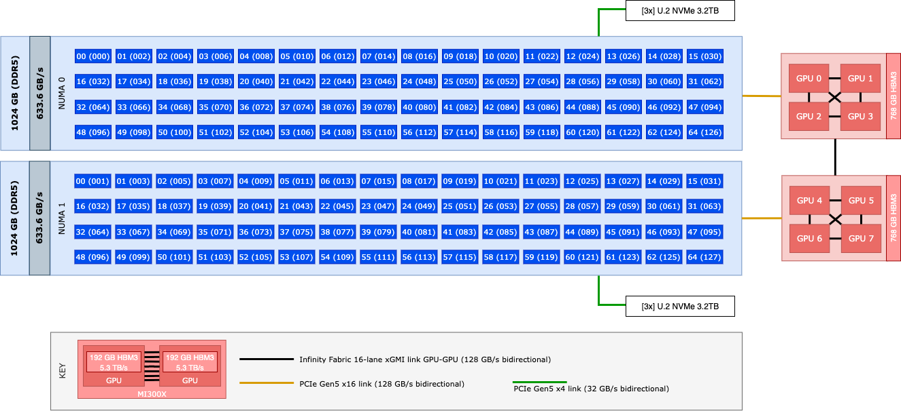

# Exploring AMD MI300X: A Deep Dive into High-Performance AI Computing

The landscape of AI and machine learning infrastructure is rapidly evolving, with AMD's MI300X representing a significant leap forward in accelerated computing capabilities. This exploration documents hands-on experience with a Dell PowerEdge XE9680[[^1] server equipped with eight MI300X accelerators[^2], providing insights into architecture, performance characteristics, and practical deployment considerations for modern AI workloads.

> **Context**: AMD Instinct accelerators have been deployed on several supercomputers of the Green500 list (June 2025)[^3]. On the first position of the ranking is "El Capitan"[^4], with the MI300A model. A very similar setup to our server is used by "Ironman"[^5], taking place 380th on the list.

## System Overview

We focus on a single multi-GPU server featuring eight AMD MI300X GPUs and dual Intel Xeon Platinum 8562Y+ CPUs[^6], along with Infinity Fabric interconnect for inter-GPU communication. The server is a Dell PowerEdge XE9680 Rack Server running OracleLinux 9.6 (arch: x86_64, kernel: 5.14.0).

The inter-connectivity of this multi-GPU node demonstrates a high-performance architecture optimized for AI and HPC workloads. An important and unique particularity of this system is that each MI300X GPU is built up of eight Accelerated Compute Dies (XCDs) with 24 GB HBM3 memory per XCD, offering a peak bandwidth of 5.3 TB/s per GPU. Each XCD has a 4 MB L2 cache shared between all compute units, with each compute unit featuring 32 KB of L1 cache. From a user's perspective, each XCD can operate independently, as an XCD features its own compute units within the shared memory architecture of the MI300X package.

The CPUs in this server are dual Intel Xeon Platinum 8562Y+ processors, featuring the Intel 7 process technology, specifically 64-core processors running at 2.8 GHz base frequency. The CPUs are attached to high-speed DDR5 memory with support for up to 5,600 MHz, distributed across multiple memory channels. A critical distinction of this system is the Infinity Fabric interconnect implementation, which provides high-performance GPU-GPU communication abilities through xGMI links forming a fully connected mesh topology between all eight accelerators, achieving up to 45-48 GB/s practical bandwidth per link. However, unlike AMD EPYC-based systems, CPU-GPU communication relies on PCIe 5.0 interfaces due to the Intel CPU architecture.

The following image depicts the architecture diagram of this server:



## Performance Profile Configuration

We have configured the processors with Intel® Speed Select Technology - Performance Profile (SST-PP)[^7] with profile 0 on both CPUs. This is the base profile with all cores active (32 cores per CPU), operating at 2,800MHz base frequency with 300W TDP.

```shell
$ sudo intel-speed-select perf-profile get-config-current-level
Intel(R) Speed Select Technology
Executing on CPU model:207[0xcf]
 package-0
  die-0
    cpu-0
      get-config-current_level:0
 package-1
  die-1
    cpu-1
      get-config-current_level:0
```

### Performance Implications

This configuration delivers specific advantages for our target workloads:

- **All 64 cores per CPU are active** at standard base and turbo frequencies as defined by Profile 0
- The configuration is optimized for parallel workloads using the full physical core count, not for limited high-frequency core boosting
- **Advanced SST options** (e.g., prioritizing fewer high-frequency cores for latency-sensitive workloads) are not currently being used

## Target Workloads and Optimization

This server is intended to fulfill the following types of workloads:
- **Deep Learning Training**
- **Large Language Model (LLM) Serving**

### Deep Learning Optimization

Deep learning training is highly parallelizable and scales well with more compute cores, leading to better throughput. Full memory bandwidth is paramount to support larger batch sizes. The SST-PP Profile 0 is ideal for this type of workload because:

- **Maximum parallelism**: All cores are available for data preprocessing and model computation
- **Consistent performance**: Stable frequencies provide predictable training times
- **Memory bandwidth utilization**: Full core count maximizes DDR5 bandwidth usage

### LLM Serving Characteristics

LLM serving also benefits from more compute cores to handle multiple requests in parallel. Unless low-latency single-stream performance is a major concern, using standard frequencies is sufficient. The SST-PP Profile 0 provides stable, predictable throughput, which is typical for LLM serving in production environments.

## Memory Performance Analysis

The system features exceptional memory capabilities that significantly exceed traditional HPC configurations:

### Memory Specifications

Each Samsung DDR5 RDIMM operates with:
- **Effective transfer rate**: 4,400 MT/s (current operational speed)
- **JEDEC speed rating**: 5,600 MHz (theoretical maximum)
- **Data bus width**: 72 bits (64 data + 8 ECC bits)
- **Capacity**: 64 GB per DIMM
- **Configuration**: 16 DIMMs per CPU socket

### Performance Metrics

| Component | Specification | Performance Impact |
|-----------|---------------|-------------------|
| Operating Speed | 4,400 MT/s | Current operational rate |
| Rated Speed | 5,600 MHz | Theoretical maximum |
| Bandwidth per DIMM | 39.6 GB/s | Individual DIMM performance |
| **Bandwidth per Socket** | **633.6 GB/s** | **16 DIMMs × 39.6 GB/s** |
| **Total System Bandwidth** | **1,267.2 GB/s** | **~6.2x higher than Frontier** |

## Infinity Fabric Interconnect Architecture

Deep learning and LLM workloads often involve trillions of parameters and require massive amounts of data to train and run, necessitating high-bandwidth networks to support data transfer. This server comes equipped with AMD Infinity Fabric[^8], a high-speed intra-host interconnect. While typically used to connect AMD CPUs and GPUs, in our Intel-based configuration, its primary use is limited to inter-GPU communications.

### xGMI Topology

Each MI300X GPU connects to **all seven other GPUs** via dedicated xGMI (External Global Memory Interconnect)[^9] links, forming a **fully connected mesh topology**. This means each GPU connects directly with every other GPU without routing through intermediary devices, creating a high-bandwidth, low-latency communication fabric optimized for AI workloads.

### Performance Specifications

- **Theoretical bandwidth**: 64 GB/s per xGMI link (unidirectional)
- **Practical bandwidth**: 45-48 GB/s per link due to CRC error correction and protocol overhead
- **Aggregate bandwidth per GPU**: Up to 315-336 GB/s total (7 links × 45-48 GB/s each)
- **Bidirectional capability**: Each link supports 128 GB/s bidirectional bandwidth

## Performance Optimization Guidelines

### CPU Thread Binding Strategy

For optimal performance with the GPU configuration:

**NUMA 0 (GPUs 0-3):**
- Use threads: 0, 2, 4, 6, 8, ..., 126 (even threads only)
- Provides full physical core resources per thread
- Maintains local memory access patterns

**NUMA 1 (GPUs 4-7):**
- Use threads: 1, 3, 5, 7, 9, ..., 127 (odd threads only)
- Ensures optimal CPU-GPU affinity
- Maximizes memory bandwidth utilization

### Verification Commands

```bash
# Check current NUMA topology
numactl --hardware

# Verify GPU NUMA assignments
rocm-smi --showtoponuma

# Bind workload to specific NUMA domain
numactl --cpunodebind=0 --membind=0 your_ai_workload
```

## Conclusions and Next Steps

This exploration reveals the MI300X platform's strengths in memory-intensive AI workloads:

1. **Exceptional Memory Capacity**: 1.5TB of high-bandwidth GPU memory enables training of larger models
2. **Optimized Architecture**: Full mesh GPU connectivity supports efficient model parallelism
3. **Balanced Design**: SST-PP Profile 0 provides optimal core utilization for parallel AI workloads
4. **Superior Memory Bandwidth**: 6.2x higher memory bandwidth compared to traditional HPC systems

### Planned Investigations

- **Benchmark Analysis**: Comparative performance testing against other AI platforms
- **Framework Optimization**: PyTorch and TensorFlow configuration for optimal MI300X utilization
- **Scaling Studies**: Multi-node communication patterns and efficiency analysis

This foundation provides the technical understanding necessary for maximizing AI workload performance on AMD's latest accelerated computing platform.

## Appendix A - NUMA Architecture

The system's NUMA topology reveals important architectural details for performance optimization:

```shell
$ numactl --hardware
available: 2 nodes (0-1)
node 0 cpus: 0 2 4 6 8 10 12 14 16 18 20 22 24 26 28 30 32 34 36 38 40 42 44 46 48 50 52 54 56 58 60 62 64 66 68 70 72 74 76 78 80 82 84 86 88 90 92 94 96 98 100 102 104 106 108 110 112 114 116 118 120 122 124 126
node 0 size: 1031111 MB
node 0 free: 1005387 MB
node 1 cpus: 1 3 5 7 9 11 13 15 17 19 21 23 25 27 29 31 33 35 37 39 41 43 45 47 49 51 53 55 57 59 61 63 65 67 69 71 73 75 77 79 81 83 85 87 89 91 93 95 97 99 101 103 105 107 109 111 113 115 117 119 121 123 125 127
node 1 size: 1032123 MB
node 1 free: 1016371 MB
node distances:
node     0    1
   0:   10   21
   1:   21   10
```

### Physical Core to Logical Thread Relationship

The CPU numbering reveals an important architectural detail with hyperthreading enabled:

| Physical Core | First Hyperthread (NUMA 0) | Second Hyperthread (NUMA 1) |
|---------------|----------------------------|------------------------------|
| Physical Core 0 | CPU Thread 0 | CPU Thread 1 |
| Physical Core 1 | CPU Thread 2 | CPU Thread 3 |
| Physical Core 2 | CPU Thread 4 | CPU Thread 5 |
| Physical Core 3 | CPU Thread 6 | CPU Thread 7 |
| ... | ... | ... |
| Physical Core 63 | CPU Thread 126 | CPU Thread 127 |

### Key Insight: Hyperthreading Distribution

This interleaved assignment means each NUMA domain contains one hyperthread from every physical core, optimizing for workload distribution while maintaining memory locality:

- **Physical Core Number** = CPU Thread Number ÷ 2
- **NUMA Node 0**: Contains first hyperthread from each physical core (even-numbered threads)
- **NUMA Node 1**: Contains second hyperthread from each physical core (odd-numbered threads)

### GPU NUMA Affinity

```shell
$ rocm-smi --showtoponuma

========================= ROCm System Management Interface =========================
==================================== Numa Nodes ====================================
GPU[0]          : (Topology) Numa Node: 0
GPU[0]          : (Topology) Numa Affinity: 0
GPU[1]          : (Topology) Numa Node: 0
GPU[1]          : (Topology) Numa Affinity: 0
GPU[2]          : (Topology) Numa Node: 0
GPU[2]          : (Topology) Numa Affinity: 0
GPU[3]          : (Topology) Numa Node: 0
GPU[3]          : (Topology) Numa Affinity: 0
GPU[4]          : (Topology) Numa Node: 1
GPU[4]          : (Topology) Numa Affinity: 1
GPU[5]          : (Topology) Numa Node: 1
GPU[5]          : (Topology) Numa Affinity: 1
GPU[6]          : (Topology) Numa Node: 1
GPU[6]          : (Topology) Numa Affinity: 1
GPU[7]          : (Topology) Numa Node: 1
GPU[7]          : (Topology) Numa Affinity: 1
=============================== End of ROCm SMI Log ================================
```

### Memory Access Patterns

The NUMA distance table shows relative cost multipliers for memory access:

- **Distance 10**: Local access (baseline cost)
- **Distance 21**: Remote access (2.1x the cost of local access)
- These represent relative performance ratios, not absolute time measurements

### Performance Implications

When binding processes to NUMA domains:
- **Use only even-numbered threads** (0, 2, 4, 6, etc.) for NUMA 0 workloads
- **Each even thread corresponds to a different physical core**, maximizing parallelism
- **Avoid mixing even and odd threads** in the same workload to prevent cross-NUMA penalties

## Appendix B - SST-PP Profile 0 Characteristics

| Attribute | Value |
|-----------|-------|
| Profile Level | 0 (Base/All-cores) |
| Enabled Cores per CPU | 64 |
| Base Frequency (MHz) | 2,800 |
| Max Turbo (few cores, MHz) | 4,100 |
| Turbo Ratio (32+ cores, MHz) | 3,800 (drops as more cores active) |
| Max Memory Frequency (MHz) | 5,600 |
| TDP (W) | 300 |
| Advanced SST Features | Disabled |

## Appendix C - Understanding the MI300X Configuration

Each discrete MI300X GPU contains **8 Accelerated Compute Dies (XCDs)**, each with 304 high-throughput Compute Units (CU)[^10]. An **XCD is a physical silicon die** within each MI300X GPU that contains the actual compute resources. We can think of it as a "mini-GPU" chiplet. Each XCD includes:

- **38 CUs** - the basic processing blocks
- **32KB L1 Cache** per CU
- **4MB shared L2 cache** across all CUs within that XCD
- **2,432 Stream Processors** (38 CUs × 64 stream processors per CU)

### System-Wide Configuration

This configuration provides:
- **64 total XCDs** across the entire system (8 GPUs × 8 XCDs per GPU)
- **2,432 total Compute Units** (8 GPUs × 304 CUs per GPU)
- **155,648 total Stream Processors** (64 XCDs × 2,432 stream processors per XCD)

### Multi-Chip Package Architecture

The following table summarizes this **chiplet design** where multiple dies are packaged together:

| Component | Per XCD | Per MI300X GPU | 8-GPU System |
|-----------|---------|----------------|---------------|
| XCDs | 1 | 8 | 64 |
| Compute Units | 38 | 304 | 2,432 |
| Stream Processors | 2,432 | 19,456 | 155,648 |
| L1 Cache | 1.2 MB | 9.7 MB | 77.6 MB |
| L2 Cache | 4 MB | 32 MB | 256 MB |

### Shared Resources Within Each GPU

Within each MI300X, the 8 XCDs share:
- **256 MB AMD Infinity Cache** (last-level cache shared across all 8 XCDs)
- **192 GB HBM3 memory** with 5.3 TB/s bandwidth
- **Infinity Fabric interconnects** for XCD-to-XCD communication within the GPU

### Why This Architecture Matters

This chiplet approach provides several advantages for deep learning and LLM workloads:
- **Scalability**: Each XCD can work independently or collaborate with others
- **Memory efficiency**: Large shared caches reduce memory bottlenecks
- **Parallel processing**: 64 XCDs can handle massive parallel workloads
- **Fault tolerance**: If one XCD has issues, others can continue operating

## Appendix D - xGMI Implementation Details

AMD Infinity Fabric in the MI300X uses xGMI (External Global Memory Interconnect) technology to create high-speed GPU-to-GPU communications.

### Technical Implementation

- Each xGMI link uses **16 lanes at 32 Gbps per lane**
- The interconnect operates at **25 GT/s transaction rate with 16 bits per transaction**
- **Zero-copy memory access** is supported, allowing any GPU to directly access another GPU's HBM3 memory without local copying

### Performance Characteristics

- **Theoretical bandwidth**: 64 GB/s per xGMI link (unidirectional)
- **Practical bandwidth**: 45-48 GB/s per link due to CRC error correction and protocol overhead
- **Aggregate bandwidth per GPU**: Up to 315-336 GB/s total (7 links × 45-48 GB/s each)
- **Bidirectional capability**: Each link supports 128 GB/s bidirectional bandwidth

This fully connected mesh topology ensures that any GPU can communicate directly with any other GPU at maximum bandwidth, eliminating bottlenecks in multi-GPU AI workloads.

## Appendix E - Installed Packages

```shell
$ sudo dnf search numactl
# Installed:
#  numactl-2.0.19-1.el9.x86_64
$ sudo dnf install rocm-smi
# Installed:
#  rocm-smi-5.7.1-1.el9.x86_64
```

## References

[^1]: https://www.dell.com/en-us/shop/ipovw/poweredge-xe9680
[^2]: https://www.amd.com/en/products/accelerators/instinct/mi300/mi300x.html
[^3]: https://top500.org/system/180307/
[^4]: https://top500.org/lists/top500/2025/06/
[^5]: https://top500.org/system/180334/
[^6]: https://www.intel.com/content/www/us/en/products/sku/237558/intel-xeon-platinum-8562y-processor-60m-cache-2-80-ghz/specifications.html
[^7]: https://lenovopress.lenovo.com/lp1465.pdf
[^8]: https://www.amd.com/content/dam/amd/en/documents/pensando-technical-docs/article/amd-ai-networking-direction-and-strategy.pdf
[^9]: https://rocm.blogs.amd.com/software-tools-optimization/mi300x-rccl-xgmi/README.html
[^10]: https://www.amd.com/content/dam/amd/en/documents/instinct-tech-docs/data-sheets/amd-instinct-mi300x-data-sheet.pdf
