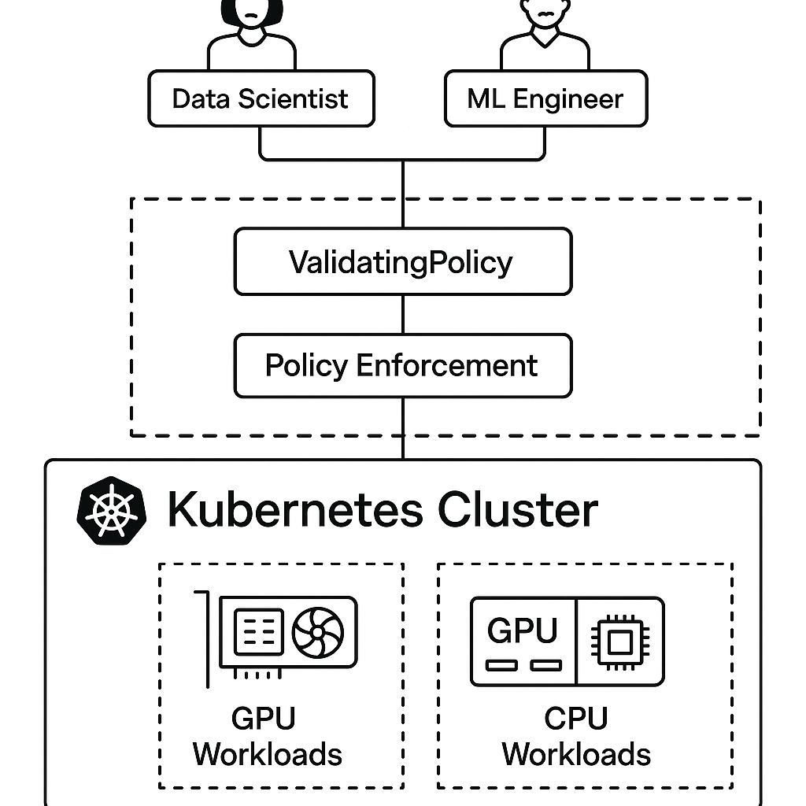
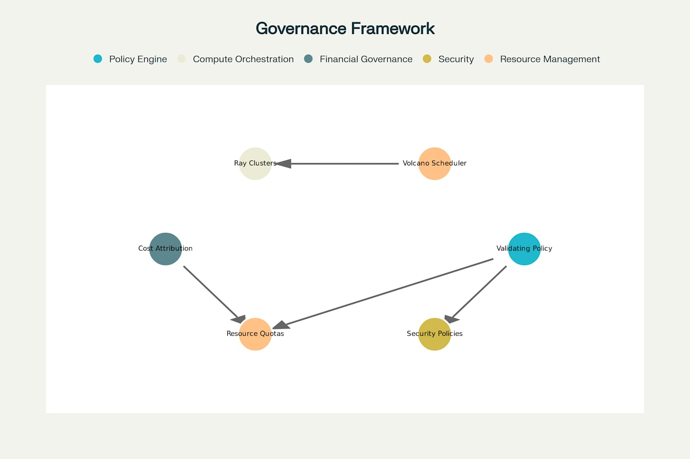
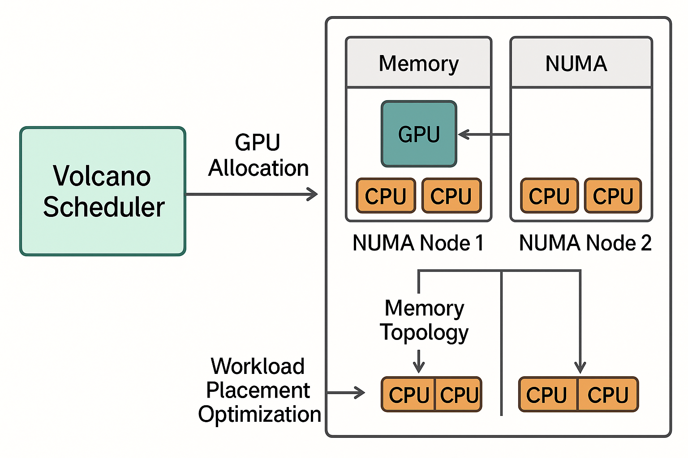

# Governing GPU and CPU Workloads at Scale: AI/ML Policy Enforcement in Multi-Tenant Kubernetes Clusters

Modern data platforms face unprecedented challenges in managing diverse AI/ML workloads across multi-tenant Kubernetes environments. As organizations scale their data science capabilities, the complexity of governing compute resources—from CPU-intensive data processing to GPU-accelerated model training—grows exponentially. This blog post explores how **Kyverno's new ValidatingPolicy** framework, introduced in version 1.14, provides a streamlined approach to enforcing governance policies for data platform teams supporting data scientists, data analysts, data engineers, and machine learning engineers.

## The Data Platform Governance Challenge

In enterprise data platforms, tenants create diverse workloads that support critical business functions without being directly in the payment processing path. These include:

- **Transaction Reconciliation Reports** that customers download or receive through automated data pushes for reconciliation processes
- **Machine learning models** that inform payment authorization decisions (with graceful degradation to older models during training failures)
- **Anti-money laundering models** that detect suspicious transaction patterns
- **Data pipelines** that transform and process customer transaction data



Multi-tenant data platform architecture with Kyverno ValidatingPolicy governance

Managing these workloads requires sophisticated governance that balances **developer productivity** with **operational control**. Traditional Kubernetes resource management falls short when dealing with the unique requirements of AI/ML workloads that may need GPU acceleration for training but only CPU resources for inference, or that require different scheduling strategies based on NUMA topology.

## ValidatingPolicy: A New Approach to Data Platform Governance

Kyverno 1.14 introduces **ValidatingPolicy**, a specialized policy type that streamlines validation logic and aligns more closely with Kubernetes-native patterns. For data platform teams, this represents a significant improvement over the previous ClusterPolicy approach.

### Key Advantages for Data Platform Teams

**Simplified Policy Structure**: ValidatingPolicy eliminates the nested rule complexity of ClusterPolicy, making policies easier to write and maintain for data science workloads.

**Enhanced Performance**: Optimized specifically for validation scenarios, reducing overhead in high-volume data processing environments[^1].

**Better CEL Integration**: First-class support for Common Expression Language expressions provides more powerful and flexible policy definitions[^2].

**Kubernetes Alignment**: Closer compatibility with Kubernetes ValidatingAdmissionPolicy patterns ensures future-proofing and easier integration[^3].

### Data Platform Workload Classification

The foundation of effective governance starts with intelligent workload classification:

```yaml
apiVersion: policies.kyverno.io/v1alpha1
kind: ValidatingPolicy
metadata:
  name: data-platform-workload-classification
spec:
  validations:
  - expression: |
      has(object.metadata.labels) &&
      has(object.metadata.labels.team) &&
      has(object.metadata.labels["cost-center"]) &&
      has(object.metadata.labels["workload-type"]) &&
      object.metadata.labels["workload-type"] in [
        "jupyter-notebook",
        "ml-training", 
        "data-processing",
        "model-inference",
        "report-generation"
      ] &&
      has(object.metadata.labels["compute-type"]) &&
      object.metadata.labels["compute-type"] in ["gpu", "cpu", "mixed"]
    message: "Data platform workloads must have required labels for governance and cost attribution"
```

This policy ensures that all workloads created by data scientists and ML engineers include the necessary metadata for proper governance, cost attribution, and resource management.

## Multi-Compute Governance Framework

Data platforms must handle both GPU-accelerated and CPU-only workloads seamlessly. The governance framework addresses several key areas:



Multi-tenant data platform governance framework components and relationships

### 1. Intelligent Resource Allocation

```yaml
apiVersion: policies.kyverno.io/v1alpha1
kind: ValidatingPolicy
metadata:
  name: gpu-resource-governance
spec:
  validations:
  - expression: |
      !object.spec.containers.exists(c, 
        has(c.resources.limits) && 
        has(c.resources.limits["nvidia.com/gpu"])
      ) || (
        has(object.spec.runtimeClassName) &&
        object.spec.runtimeClassName == "nvidia" &&
        object.spec.tolerations.exists(t,
          t.key == "nvidia.com/gpu" && t.operator == "Exists"
        ) &&
        int(object.spec.containers[^0].resources.limits["nvidia.com/gpu"]) <= 4
      )
    message: "GPU workloads must use nvidia runtime class, appropriate tolerations, and respect resource limits (max 4 GPUs per pod)"
```


### 2. Cost Attribution and Billing

For accurate cost tracking across data science teams:

```yaml
apiVersion: policies.kyverno.io/v1alpha1
kind: ValidatingPolicy
metadata:
  name: cost-attribution-validation
spec:
  validations:
  - expression: |
      has(object.metadata.labels) &&
      has(object.metadata.labels["opencost.io/team"]) &&
      has(object.metadata.labels["opencost.io/workload-category"]) &&
      object.metadata.labels["opencost.io/workload-category"] in [
        "training", "inference", "development", "data-processing"
      ]
    message: "All workloads must include OpenCost labels for accurate billing attribution"
```


### 3. Security and Compliance

Data platforms handling financial data require strict security policies:

```yaml
apiVersion: policies.kyverno.io/v1alpha1
kind: ValidatingPolicy
metadata:
  name: security-compliance-validation
spec:
  validations:
  - expression: |
      object.spec.securityContext.runAsNonRoot == true &&
      !object.spec.containers.exists(c, 
        has(c.securityContext.privileged) && 
        c.securityContext.privileged == true
      )
    message: "Data platform workloads must run as non-root and cannot use privileged containers"
```


## Volcano Integration for NUMA-Aware Scheduling

**Optional Enhancement**: For organizations with NUMA architectures, Volcano scheduler provides significant performance benefits for GPU workloads through NUMA-aware scheduling[^4][^5][^6]. This is particularly valuable for memory-intensive ML training workloads where cross-NUMA memory access can create bottlenecks[^7].



NUMA-aware GPU scheduling with Volcano scheduler for optimal performance

### When to Consider Volcano

- **NUMA architectures** with multiple memory domains
- **GPU-intensive workloads** requiring high memory bandwidth
- **Large-scale training jobs** where memory locality affects performance
- **Multi-socket systems** with complex topology


### Volcano Queue Configuration

```yaml
apiVersion: scheduling.volcano.sh/v1beta1
kind: Queue
metadata:
  name: ml-training-queue
spec:
  reclaimable: true
  weight: 100
  capability:
    nvidia.com/gpu: "16"
    cpu: "64"
    memory: "256Gi"
  affinity:
    nodeAffinity:
      preferredDuringSchedulingIgnoredDuringExecution:
      - weight: 100
        preference:
          matchExpressions:
          - key: node.kubernetes.io/numa-topology
            operator: Exists
```

**Important Note**: Volcano integration is completely optional. Organizations using Kueue, the default Kubernetes scheduler, or other scheduling systems achieve excellent results with the core ValidatingPolicy approach. Volcano's NUMA awareness provides additional optimization for specific hardware configurations but is not required for effective data platform governance.

## Getting Started

### Prerequisites

- **Kubernetes 1.29+** cluster (1.32+ for NUMA-aware Memory Manager support[^7])
- **Kyverno 1.14+** with ValidatingPolicy support
- **KubeRay operator** for distributed training workloads
- **Optional**: NVIDIA GPU Operator for GPU workloads
- **Optional**: Volcano scheduler for NUMA optimization


### Quick Setup Guide

1. **Install Kyverno 1.14**:
```bash
kubectl apply -f https://github.com/kyverno/kyverno/releases/download/v1.14.0/install.yaml
```

2. **Deploy KubeRay for distributed training**:
```bash
helm repo add kuberay https://ray-project.github.io/kuberay-helm/
helm install kuberay-operator kuberay/kuberay-operator
```

3. **Apply data platform governance policies**:
```bash
kubectl apply -f governance-policies/workload-classification.yaml
kubectl apply -f governance-policies/resource-limits.yaml
kubectl apply -f governance-policies/cost-attribution.yaml
```

4. **Optional: Deploy Volcano for NUMA optimization**:
```bash
helm repo add volcano-sh https://volcano-sh.github.io/helm-charts
helm install volcano volcano-sh/volcano
```

## Looking Ahead: The Future of Data Platform Governance

As AI/ML workloads continue to evolve, governance frameworks must adapt to support:

- **Automated policy generation** based on workload characteristics and historical performance
- **Cross-cluster governance** for distributed data processing pipelines
- **Enhanced cost optimization** through predictive resource allocation
- **Compliance automation** for regulatory requirements in financial services

The combination of Kyverno's ValidatingPolicy with optional Volcano scheduler integration provides a robust foundation for these future enhancements while maintaining the flexibility that data science teams require for innovation.

## Conclusion

Effective governance of AI/ML workloads in multi-tenant data platforms requires a thoughtful balance between control and flexibility. Kyverno 1.14's ValidatingPolicy framework, combined with intelligent workload classification and optional NUMA-aware scheduling, enables platform teams to support diverse data science workflows while maintaining operational excellence.

This approach represents a practical path forward for scaling data platform governance. By starting with core ValidatingPolicy patterns and gradually adding advanced features like Volcano scheduling based on specific needs, teams can build sustainable governance frameworks that grow with their AI/ML capabilities.

The key is not choosing between control and innovation, but creating governance patterns that enable both—allowing data scientists, analysts, and ML engineers to focus on delivering business value while ensuring the platform remains secure, cost-effective, and compliant with enterprise requirements.

## References

[^1]: https://main.kyverno.io/blog/2025/04/25/announcing-kyverno-release-1.14/

[^2]: https://kyverno.io/blog/2023/11/13/using-cel-expressions-in-kyverno-policies/

[^3]: https://nirmata.com/2025/04/28/announcing-kyverno-release-1-14/

[^4]: https://dl.acm.org/doi/10.1145/3680549

[^5]: https://arxiv.org/abs/2502.10923

[^6]: https://support.huaweicloud.com/intl/en-us/eu-west-0-usermanual-cce/cce_10_0425.html

[^7]: https://www.alibabacloud.com/help/en/ack/ack-managed-and-ack-dedicated/user-guide/enable-numa-topology-aware-scheduling

[^8]: https://kubernetes.io/docs/tasks/administer-cluster/memory-manager/
